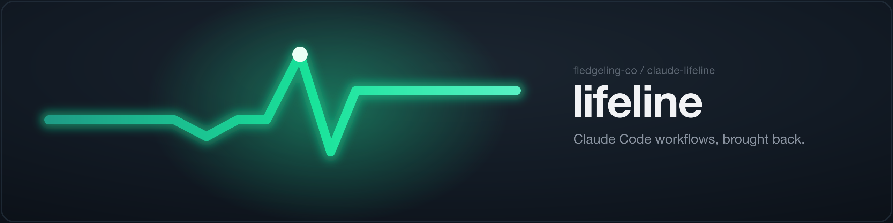
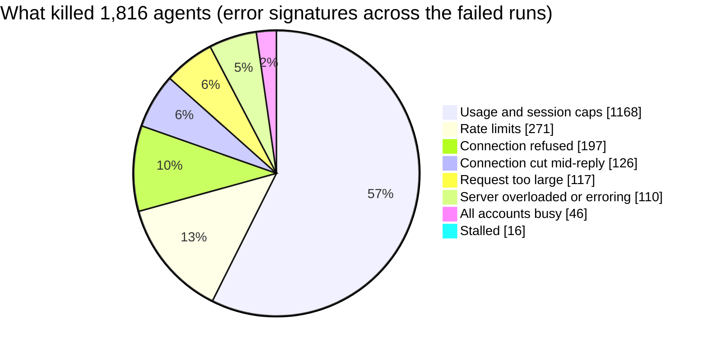
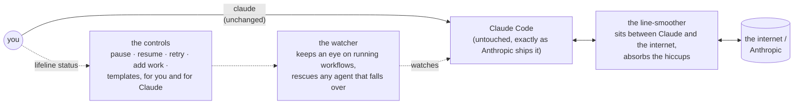

<div align="center">



[](https://github.com/fledgeling-co/claude-lifeline/actions/workflows/ci.yml)


**Keeps your Claude Code workflows from quietly losing work.** It runs alongside Claude Code, catches the AI agents that would otherwise vanish mid-job, and brings them back.

</div>

```bash
curl -fsSL https://raw.githubusercontent.com/fledgeling-co/claude-lifeline/main/install.sh | bash
```

After that your command is still `claude`. There's nothing to remember.

## Why this exists

If you run big jobs in Claude Code, the kind where it fans out a whole team of AI agents to work in parallel, you've probably trusted the word "completed" at the end. I did too, until I kept noticing the finished work had holes in it. Files that should have been touched weren't. Steps that were meant to happen hadn't.

So I counted.

> [!IMPORTANT]
> Across 1,054 of my own workflow runs, **646 (61%) had quietly lost at least one agent**. Out of 4,630 agents, **1,816 (39%) had died** on jobs the app still reported as done.

Here's what was happening. When one of those agents hits a snag, a rate limit, the network dropping for a second, running into a usage cap, Claude Code doesn't wait and try again. It drops that agent on the spot, quietly takes it out of the count, and calls the whole run finished. Nothing tells you. So "the workflow finished" and "the work actually got done" turned out to be two completely different claims.

This is what killed them, counted across the error records of those failed runs:



Every slice of that chart except one ("request too large") is a *temporary* problem. Waiting and trying again fixes it. Nothing was waiting, and nothing was trying again.

lifeline is the fix. It sits next to Claude Code and catches those agents before they disappear, then gets them back on their feet.

## What it adds, at a glance

lifeline doesn't replace Claude Code's workflows. It's the same feature you already use, with the failures handled.

| | You get | Which means |
|---|---|---|
| 🔁 | **Automatic retries** | Temporary problems get retried with growing patience, up to 30 times, instead of one strike and out |
| ⏸️ | **Usage-cap recovery** | A capped agent parks and picks back up the moment capacity frees, whichever account frees first |
| 🔄 | **Retry = resume, one button** | Press it on anything failed; it's always safe to press; the red cross clears itself |
| ⚠️ | **Warnings, not alarms** | One stumbling agent shows as a warning while its teammates keep working; red is reserved for real failure |
| 🌐 | **Offline auto-pause** | Internet drops, the run pauses; internet returns, it resumes; a train tunnel costs you nothing |
| ➕ | **Change work mid-run** | Hand a running workflow new tasks, or pull ones not yet started, without rebuilding it |
| 📋 | **Reusable templates** | Save the workflows you keep rebuilding; lifeline can even spot them in your history for you |
| 🤖 | **Claude knows** | Claude Code's own assistant is told about all of this, so it can offer to retry, pause, or reuse a template |

### The details

**It retries the stumbles for you.** When an agent hits a temporary problem, a rate limit, an overloaded server, the internet blipping, lifeline waits a sensible amount of time and tries again, waiting a bit longer each go, up to 30 times, instead of giving up on the first trip. It also knows which problems are worth retrying and which aren't; a request that's genuinely too big to ever fit, for instance, doesn't get thrown at the wall 30 times for nothing.

**It waits out usage caps properly.** Hit a usage or session limit and lifeline parks that agent and keeps an eye out, picking it back up the moment there's room again. If you run several accounts through a proxy and get "all accounts busy", same thing. It doesn't just sleep until one fixed reset time, because when you've got a few accounts they free up at different moments, and lifeline takes the first one that does.

**Retry and resume are the same button.** Press retry on a failed agent, or on the whole workflow, and it just picks up where it left off. It's safe to press when there's nothing to fix, and the automatic retries are pressing it for you anyway.

**A stumble is a warning, not an alarm.** If one agent trips while the rest of the team is still working, the workflow shows a warning, not a big red error. It only goes properly red when the whole job has actually failed. One agent out of twelve having a bad moment shouldn't look like the house is on fire.

**You can pause and resume.** Pause one agent, or a whole workflow and every agent under it, by hand whenever you want. lifeline also pauses on its own the moment your internet drops, and picks back up when it returns.

**You can change the work while it's running.** Hand a running workflow a new task, or pull a task you haven't started yet, without tearing the whole thing down and building it again from scratch.

**Your regular jobs become templates.** The workflows you run over and over can be saved and re-run whenever you like. lifeline can also look back through everything you've run and point out the ones you keep rebuilding by hand, so you can save them once.

**Claude knows it can do all this.** Claude Code's own assistant is told about these abilities, so it can offer to retry a failed agent, pause a run, add a task, or reach for one of your templates, without you having to spell it out.

## How it works

The honest version, because it's the interesting part.

lifeline never changes or touches the actual Claude Code app that Anthropic ships. That app is sealed shut, and it gets fully replaced every time it updates, so reaching inside it would be both risky and a waste of time. lifeline works entirely from the outside, through three quiet helpers:



- one sits on the line between Claude and the internet and smooths over the connection hiccups before they ever reach you;
- one keeps an eye on your running workflows and steps in to recover any agent that falls over;
- one gives you, and Claude, the buttons: pause, resume, add work, save a template.

Your command is still just `claude`. lifeline is doing its job in the background while you carry on exactly as before.

## The status window

There's now a small menu-bar app, a pulse in your menu bar. Click it and you see everything you're running at a glance, without going near the terminal.

Runs are grouped by **project**, with the **workflow** name underneath, and each one shows how many agents are running and how many are still waiting to start. Open a run and you get the detail:

- each agent's state: **running, retrying, stalled, failed or done**
- how long it's been going, and how full its **context window** is (the real token count)
- the run's latest line, and the line from your own Claude session that kicked it off
- a **Retry** on anything failed or stalled, and **pause** or **resume** for the whole run

Runs that have just finished go grey and drop to the bottom, then clear themselves after an hour, so the list stays about what's live. If you'd rather keep it open, drag it off the menu bar and it becomes its own resizable window. It works with VoiceOver and follows your system text-size setting.

The one-line install sets it up; it builds the app for you if you've got Apple's command-line tools, and everything else still works if you haven't. If you'd sooner not build anything, grab the notarised app from the [Releases](https://github.com/fledgeling-co/claude-lifeline/releases) page and drop it in Applications.

## How it keeps working when Claude Code updates

Claude Code updates itself roughly every day. Because lifeline never edits that app, an update can't break it the way editing it would.

> [!NOTE]
> lifeline keeps a fingerprint of the handful of things it counts on staying the same shape. Every time Claude Code updates, a quiet background check re-confirms that fingerprint still matches. If Anthropic ever changes something lifeline leans on, it tells you plainly and steps back rather than doing anything clever. It never guesses.

On top of that, an automated check runs every day against each new Claude Code release, so if something ever does shift, it's usually caught before it would reach you at all.

There's one thing lifeline does take over: the `claude` command itself. Claude Code can't repoint that the way it normally would when it updates, so lifeline resolves the newest version you've got every time you launch; the daily update still lands on its own, with nothing for you to do. If one's still downloading when you start, it runs the version you had a moment ago rather than a half-finished file, and `lifeline doctor` reports the version you last launched against the newest one installed, so it can never quietly fall behind.

## Install

macOS, one line:

```bash
curl -fsSL https://raw.githubusercontent.com/fledgeling-co/claude-lifeline/main/install.sh | bash
```

That sets everything up, points Claude Code through lifeline, and gets out of your way. Your command stays `claude`.

> [!NOTE]
> If you already had Claude Code open when you installed, restart those sessions so they start routing through lifeline. Any you open from now on already do.

**Check it's working:**

```bash
lifeline status    # what your workflows are doing right now
lifeline doctor    # a quick health check of lifeline itself
```

**Remove it cleanly** (restores everything to exactly how it was, one line, nothing to set up first):

```bash
curl -fsSL https://raw.githubusercontent.com/fledgeling-co/claude-lifeline/main/uninstall.sh | bash
```

> [!NOTE]
> Quitting the app just closes the status window; lifeline and the `claude` patch keep running in the background. To actually remove it, use **Uninstall lifeline** from the app's `···` menu, or run the uninstall line above. Quitting and uninstalling are different on purpose.

> [!WARNING]
> If you set an `ANTHROPIC_API_KEY` directly in your shell, Claude Code talks straight to the internet and skips past lifeline, so it can't help on that path. `lifeline doctor` will tell you if that's happening.

## Where it's at

lifeline is macOS-focused for now. The core, the part that stops your work quietly disappearing, is done, tested, and running.

- [x] Automatic retries with growing patience (up to 30, only where retrying helps)
- [x] Usage-cap and "all accounts busy" recovery
- [x] Silent-loss detection and rescue
- [x] Offline auto-pause and auto-resume
- [x] Pause / resume / retry controls, for you and for Claude
- [x] Add and remove work on a running workflow
- [x] Reusable workflow templates, plus mining your history for them
- [x] The daily self-check against new Claude Code releases
- [x] One-line install and one-line uninstall
- [x] A status window: a menu-bar app showing your runs and agents live, with click-to-retry, pause and resume, so you're not reading it from the terminal
- [ ] Beyond macOS

I'd rather ship the thing that fixes the actual problem and be straight about what's still coming than dress it up.

## Licence

MIT.
