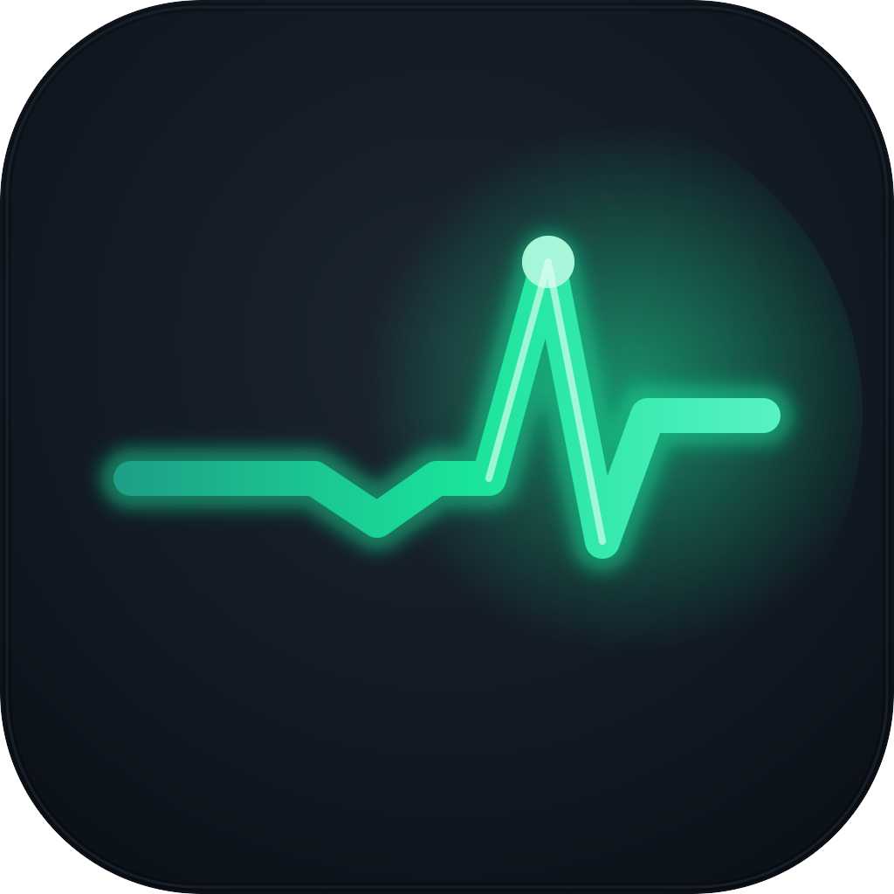

# lifeline — app icon concepts



**Chosen: Concept 1, Recovery Pulse** (the layered SVG master `concept-1-recovery-pulse.svg`).
Browse every concept and engine take in [`index.html`](index.html).


Five committed concepts, each delivered through the mac-design-studio three-engine pipeline:

- **Engine A** — hand-authored layered SVG (`concept-*.svg`), one named `<g>` per layer
  (`bg` / `mid` / `fg` / `highlight`), Icon Composer-ready. **The canonical masters.**
- **Engine B** — Arrow vector takes (`engineB/*.svg`), independent editable-vector
  interpretations of the same specs.
- **Engine C** — GPT Image raster material takes (`engineC/*.png`), steered with
  Tahoe-register corpus references. Material targets and hero previews only; never
  shipped as-is (a flat raster fails variant-robustness by construction).

Contact sheets: `contact-sheet.png` (Engine A at 1024/128/32/16) and
`engines-contact-sheet.png` (cross-engine).

## The five concepts

### 1 · Recovery Pulse — Dark-Field Emissive  ★ recommended
A heartbeat line that flatlines, dips, then recovers into one tall beat with a bright
node at the peak. The whole app in one gesture: it was going under, and it came back.
Emissive mint (#19E39A) on charcoal cushion. Signature device: the *recovery* shape of
the line (down, then decisively up), not a generic ECG.
**Audit 11/12.** Silhouette names itself at 16px; identity survives tint (shape+value);
palette economy 1 hue. Liability: ECG could read "health app" at a blink; the flatline
prefix is what argues against that.
Raster note: Engine C confirmed the material but added a glowing border frame; ignore
the frame, keep the glow register.

### 2 · Caught Line — Tahoe saturated tile + white frost
A frosted-white line dips and hooks back up, catching a round node in the low of its
curve, on a teal gel tile. White as a material (ground bleeds through).
**Audit 9/12.** Clean and native; the "catch" reads softly (node can read as a drip).
Engine C's take accidentally produced a figure-with-raised-arms double-read (line crest
= arms, node = head) — a genuinely stronger metaphor worth folding into the master if
this concept is chosen.

### 3 · Ring Buoy — Tahoe porcelain + gel object  ★ runner-up
The literal lifeline: a coral gel ring-buoy with four frosted lashings on porcelain, a
teal node (the rescued agent) resting safely in the centre. Warm coral deliberately
breaks the corpus's blue-default.
**Audit 11/12.** Instantly nameable at every size including 16px; strongest silhouette
of the set. Liability: adjacent to "help/support" iconography (Apple's own Tips/Help
territory) — the teal agent-node in the centre is what makes it *this* app.
Engine C's material take is excellent; ship path = Engine A geometry + C's material cues.

### 4 · Safety Line — Monochrome Logomark
One continuous rope forming a lowercase "l" that curls into a rescue hook cradling a
mint bead. Austere Vercel/Linear register.
**Audit 7/12 — parked.** At 16px it collapses toward an exclamation mark; and the
Engine C material take exposed a noose association in the hanging-rope-with-loop
composition that I'd rather not ship in a tool about things dying. Kept for the record;
not recommended.

### 5 · Caught Before the Fall — dark gel + emissive interior
A silver safety line strung between the top corners bows under a glowing amber orb it
has just caught. Premium, nocturnal, the sanctioned emissive-interior move.
**Audit 9/12.** Gorgeous large; at 16px the thin line fades and the read drifts toward
"pendant necklace" (Engine B confirmed the drift). Worth keeping as the "pro dark"
alternative if the line gains weight.

## Recommendation

**Ship Concept 1 (Recovery Pulse)**, with **Concept 3 (Ring Buoy)** as the alternate if
a warmer, more literal mark is preferred. Both pass the non-negotiables (mask, grid,
silhouette, 16px); both carry identity in shape+value so Dark/Clear/Tinted variants
hold.

To produce the .icns from a chosen master:
```bash
# render the layered SVG at all sizes and build an iconset
for s in 16 32 64 128 256 512 1024; do
  rsvg-convert -w $s -h $s concept-1-recovery-pulse.svg -o icon_${s}x${s}.png
done
# assemble with iconutil / Icon Composer (layers map from the SVG <g> ids)
```
